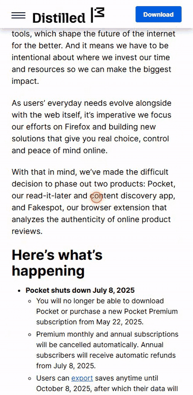

<div align="center">

# rightread

**Capture links from anywhere. Read them clean, later, offline.**



_Paste a link. It gets extracted and it's ready to read, clean and offline._

</div>

Save a link from your phone's share sheet or your browser toolbar. rightread
strips the page down to the article, with no ads, no cookie banners and no
newsletter popups, and keeps it readable offline in typography built for long
reading.

## Why this exists

On 22 May 2025, Mozilla [announced it was winding Pocket
down](https://blog.mozilla.org/en/mozilla/building-whats-next/). I'd used it for
years for one thing: saving something on my phone and reading it
properly later, usually when I was on the tube.

The alternatives were mostly 'meh' so I built the small
thing I missed. One queue, clean text, works on a plane, running on a server I
control with the whole library in a single SQLite file I can copy.

The reading list lives on your own server, but the AI features are not local. With
them on, an article's text goes to [OpenRouter](https://openrouter.ai) to be
classified and embedded. Leave `OPENROUTER_API_KEY` unset and none of that
happens: no article text leaves the box, and capturing, reading, keyword search
and the queue all work exactly as before.

You could also move the AI features locally but its not something I need to do right now but 
open to any contributions to help with that.

## Built AI-second

I built this AI-second rather than AI-first. The core version had to work
properly before a model was allowed near it to meet my needs. That's a practical choice, not a
philosophical one: semantic search is useless if extraction produces junk, and a
similarity graph over badly parsed pages is a picture of your parser's mistakes.

The commit history is the honest record. **The first commit contains no AI code
at all**, just fetching, [Readability](https://github.com/mozilla/readability)
extraction, sanitising, the reader, and the ordered queue. That loop was
deployed and in daily use before a model touched anything. Classification came
next, then keyword and semantic search, then the graph and Discover.

## What it does

**Capture from anywhere.** Android share (PWA share target), an Edge/Chrome
extension, or a paste box in the app. I mostly use the Android share and in one action get
the article saved to rightread. 

**Extract properly.** Readability pulls out the article, DOMPurify sanitises it
under a strict allowlist, then a tidy pass removes the wrappers, empty paragraphs
and wiki `[edit]` links Readability leaves behind.

**Read offline.** A service worker caches every article you open. Serif type,
adjustable size and width, light/sepia/dark, and it remembers where you stopped.

**Prioritise.** One ordered queue with move up/down, a star for things that
matter, and an archive for things you've finished.

**Bring things to you.** Add sites to watch and topics you care about, and
matching articles collect under Discover.

**Search two ways.** Keyword search over the full text, and semantic search that
finds pages about what you asked even when they never use your words. The two
show as separate labelled groups, never merged: a keyword hit is a fact, a
semantic hit is a guess.

**See how it connects.** A force-directed map of the whole library, built from
the same embeddings, where the clusters are reading interests nobody declared.

## Getting started (hereon most of this content is AI Assisted)

```bash
npm install
npx prisma db push        # creates prisma/dev.db
npm run dev               # http://localhost:3002
```

Sign in with your email. **Without a Resend key the magic link is printed to
the server console.** Copy it from there.

Stack: Next.js 16 · React 19 · Prisma + SQLite · Auth.js (magic link via Resend)
· Tailwind 4 · Docker behind Caddy.

### Environment

| Variable | Purpose |
| --- | --- |
| `DATABASE_URL` | SQLite path. Relative paths resolve from the project root. |
| `AUTH_SECRET` | Session signing key. `npx auth secret`. Never share it between apps. |
| `AUTH_URL` | Public origin in production. Leave unset for local/LAN use. |
| `AUTH_TRUST_HOST` | `true`. Lets the sign-in link follow the host you opened. |
| `AUTH_RESEND_KEY` | Resend API key. Blank means the link is logged to the console. |
| `EMAIL_FROM` | Sender address. Must be at a Resend-verified domain once there's more than one user. |
| `RIGHTREAD_ALLOWED_EMAILS` | Comma-separated allow list. **Blank means nobody can sign in.** |
| `OPENROUTER_API_KEY` | OpenRouter key. Without it classification degrades to `other` and nothing breaks. |
| `OPENROUTER_MODEL` | Defaults to `openai/gpt-5.6-luna`. |
| `OPENROUTER_EMBED_MODEL` | Defaults to `openai/text-embedding-3-small`. Changing it invalidates stored vectors. |
| `OPENROUTER_SEMANTIC_FLOOR` | Semantic search cut-off, 0 to 1. Defaults to `0.22`. |
| `GRAPH_EDGE_FLOOR` / `GRAPH_MAX_NODES` | Graph noise guard (`0.15`) and size cap (`2000`). |
| `RIGHTREAD_PHRASE_FLOOR` / `RIGHTREAD_REC_FLOOR` | Discover cut-offs (`0.32` phrase, `0.45` article). |

> Anything the app reads at runtime needs an explicit entry under `environment:`
> in `docker-compose.yml`. `--env-file` only makes a value available for
> `${...}` substitution in that file; it does not pass it into the container. A
> variable listed there but missing from the env file arrives as an empty string,
> not unset, so give each a `:-` default. The exception is
> `RIGHTREAD_ALLOWED_EMAILS`, where empty already means the safe thing.

**Who can sign in.** Anyone who reaches the login page can request a magic link,
so `RIGHTREAD_ALLOWED_EMAILS` is the gate. Empty or unset denies everyone on
purpose, which is loud and fixed by setting one variable, rather than a silent
production-only hole. The list is checked in the Auth.js `signIn` callback, once
before the email goes out and once when the link is clicked, so removing an
address kills a link already in someone's inbox.

**On a LAN**, open the phone at the machine's address (`http://192.168.x.x:3002`),
not `localhost`, with `AUTH_URL` unset, and the sign-in link points back at that
same host. Note that PWA install, the share target and the service worker all
need HTTPS, and fail silently without it.

## Capturing links

**Android.** Open the site in Chrome, menu → **Install app**. rightread then
appears in the share sheet from any app. (iOS Safari has no share-target support;
use a Shortcut that POSTs to `/api/capture`.)

**Extension.** Load `extension/` unpacked in Edge or Chrome, create a capture
token in Settings, and paste it plus the server address into the extension
options. Then use the toolbar button, `Ctrl+Shift+S`, or right-click → Save.

**Anything else.**

```bash
curl -X POST https://your-host/api/capture \
  -H "Authorization: Bearer rr_your_token" \
  -H "Content-Type: application/json" \
  -d '{"url":"https://example.com/article"}'
```

## Under the hood

A few decisions worth calling out. The measurements and edge cases behind them
live in comments next to the code.

**Classification.** Every saved page is sorted into one of five kinds
(`conversation`, `article`, `blog`, `reference`, `other`) at capture. A small
table of URL rules handles the dozen hosts where a server-side fetch fails (a
fetch of Reddit is an 8 KB JavaScript shell); the model handles the rest from
title, URL and the first ~6 KB of text; and it falls back to `other` whenever the
model is unavailable, so classification never blocks a capture. Measured 44/44 on
a tuning set plus a held-out set the prompt never saw, at about $0.0001 a page.

**Search.** Keyword search is SQLite FTS5 with bm25, weighted so a title match
outranks a body match, and it treats operators as literal text so a query can
match nothing but never errors. The index is kept in sync by SQLite triggers, not
app code, because one forgotten write path rots it silently. Semantic search
compares a 1536-dim embedding per item by brute-force cosine (single-digit
milliseconds at a thousand items; revisit at 50k). The `0.22` floor was measured:
an earlier guess of `0.34` sat above most real matches and returned nothing.

**Graph.** `/graph` places each page near the ones it resembles, from the same
embeddings, with no new API calls. Each page links to its few nearest neighbours
(top-k, not a global threshold) so density stays constant and nothing hairballs.
The strength bands calibrate to your own library: **strong** means "closer than
99% of pairs *here*", because a fixed cutoff can't tell a real match from the fact
that two long documents both read as English prose (unrelated pairs still score
~0.24). It renders as SVG, and as a plain list for accessibility.

**Discover.** Add sites to watch and it polls them, extracting and embedding new
entries. Add a key phrase and it scores everything that arrives against that
phrase by meaning, so "running models on your own hardware" finds articles that
never use those words. Saving an article also pulls in similar unseen ones,
filed under "because you saved X". Recommendations are per-article, so dismissing
one holds however it's found next, and an empty Discover says which of the three
reasons it's empty rather than staying blank.

## How it works

| Area | Where |
| --- | --- |
| Extraction / sanitising / tidying | `src/lib/extract.ts`, `sanitize.ts`, `tidy.ts` |
| Capture | `src/lib/capture.ts`, `src/app/api/capture` |
| Ordering | `src/lib/reorder.ts` (sparse float positions) |
| Reader | `src/app/read/[id]`, `.prose-reader` in `globals.css` |
| Offline | `public/sw.js` |
| Classification / LLM | `src/lib/classify/`, `src/lib/openrouter.ts` |

**Ordering** uses sparse floats: a move sets the item's position to the midpoint
of its neighbours, one row written rather than a renumbered list, and the queue
renormalises itself when a gap collapses. There's only one queue; starring marks
and filters, it never reorders.

**Extraction runs detached** from the capture request, so a save confirms
instantly and the text fills in a second later. A page that can't be extracted
stays in the list with the error, a retry, and a link to the original, so a
failed extraction never loses the save.

## Security

- Article HTML is rendered with `dangerouslySetInnerHTML`, so it's sanitised with
  DOMPurify under a strict allowlist before storage. An adversarial XSS and mXSS
  corpus is in `tests/security.test.mts`.
- `/api/capture` fetches user-supplied URLs server-side, so hosts are checked
  against private ranges (cloud metadata, IPv6 loopback and mapped addresses) on
  every redirect hop, including client-side `<meta refresh>` bounces. The check
  is on the hostname, not the resolved address, so a DNS name pointed at
  `127.0.0.1` would not be caught.
- Capture tokens are stored as SHA-256 hashes; the plaintext is shown once.
- Cookie-authenticated capture is same-origin only; cross-origin callers need a
  bearer token, which a browser never attaches automatically.

## Scripts

```bash
npm run dev            # dev server
npm run build          # production build
npm test               # the full suite
npm run db:backup      # timestamped SQLite backup
npm run db:merge       # additive merge between two databases
npm run search:backfill  # index existing items
```

`scripts/db-merge.mjs` is additive: it inserts, never updates or deletes, and
matches users by email rather than row id, so nothing is lost unless you delete
it in the app. See [DEPLOYMENT.md](DEPLOYMENT.md) for the full deploy procedure.

## Licence

[MIT](LICENSE). Use it, change it, host it, sell it; keep the copyright notice,
no warranty. One thing a code licence doesn't settle: the articles rightread
saves belong to whoever wrote them, and stripping a page down for your own
reading is a different thing from republishing it. If you run an instance for
other people, that part is your call.
